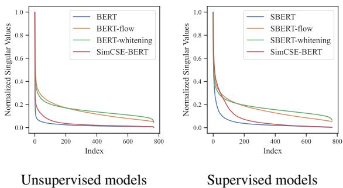

# SimCSE: Simple Contrastive Learning of Sentence Embeddings

Tianyu Gao†* Xingcheng Yao†* Danqi Chen†  †Department of Computer Science, Princeton University  ‡Institute for Interdisciplinary Information Sciences, Tsinghua University  {tianyug, danqic}@cs.princeton.edu  yxc18@mails.tsinghua.edu.cn

# Abstract

This paper presents SimCSE, a simple contrastive learning framework that greatly advances state- of- the- art sentence embeddings. We first describe an unsupervised approach, which takes an input sentence and predicts itself in a contrastive objective, with only standard dropout used as noise. This simple method works surprisingly well, performing on par with previous supervised counterparts. We find that dropout acts as minimal data augmentation, and removing it leads to a representation collapse. Then, we propose a supervised approach, which incorporates annotated pairs from natural language inference datasets into our contrastive learning framework by using "entailment" pairs as positives and "contradiction" pairs as hard negatives. We evaluate SimCSE on standard semantic textual similarity (STS) tasks, and our unsupervised and supervised models using BERTbase achieve an average of  $76.3\%$  and  $81.6\%$  Spearman's correlation respectively, a  $4.2\%$  and  $2.2\%$  improvement compared to the previous best results. We also show both theoretically and empirically—that the contrastive learning objective regularizes pre- trained embeddings' anisotropic space to be more uniform, and it better aligns positive pairs when supervised signals are available.

# 1 Introduction

Learning universal sentence embeddings is a fundamental problem in natural language processing and has been studied extensively in the literature (Kiros et al., 2015; Hill et al., 2016; Conneau et al., 2017; Logeswaran and Lee, 2018; Cer et al., 2018; Reimers and Gurevych, 2019, inter alia). In this work, we advance state- of- the- art sentence embedding methods and demonstrate that a contrastive objective can be extremely effective when coupled with pre- trained language models such as BERT (Devlin et al., 2019) or RoBERTa (Liu et al., 2019). We present SimCSE, a simple contrastive sentence embedding framework, which can produce superior sentence embeddings, from either unlabeled or labeled data.

Our unsupervised SimCSE simply predicts the input sentence itself with only dropout (Srivastava et al., 2014) used as noise (Figure 1(a)). In other words, we pass the same sentence to the pre- trained encoder twice: by applying the standard dropout twice, we can obtain two different embeddings as "positive pairs". Then we take other sentences in the same mini- batch as "negatives", and the model predicts the positive one among the negatives. Although it may appear strikingly simple, this approach outperforms training objectives such as predicting next sentences (Logeswaran and Lee, 2018) and discrete data augmentation (e.g., word deletion and replacement) by a large margin, and even matches previous supervised methods. Through careful analysis, we find that dropout acts as minimal "data augmentation" of hidden representations while removing it leads to a representation collapse.

Our supervised SimCSE builds upon the recent success of using natural language inference (NLI) datasets for sentence embeddings (Conneau et al., 2017; Reimers and Gurevych, 2019) and incorporates annotated sentence pairs in contrastive learning (Figure 1(b)). Unlike previous work that casts it as a 3- way classification task (entailment, neutral, and contradiction), we leverage the fact that entailment pairs can be naturally used as positive instances. We also find that adding corresponding contradiction pairs as hard negatives further improves performance. This simple use of NLI datasets achieves a substantial improvement compared to prior methods using the same datasets. We also compare to other labeled sentence- pair

  
Figure 1: (a) Unsupervised SimCSE predicts the input sentence itself from in-batch negatives, with different hidden dropout masks applied. (b) Supervised SimCSE leverages the NLI datasets and takes the entailment (premise-hypothesis) pairs as positives, and contradiction pairs as well as other in-batch instances as negatives.

datasets and find that NLI datasets are especially effective for learning sentence embeddings.

To better understand the strong performance of SimCSE, we borrow the analysis tool from Wang and Isola (2020), which takes alignment between semantically- related positive pairs and uniformity of the whole representation space to measure the quality of learned embeddings. Through empirical analysis, we find that our unsupervised SimCSE essentially improves uniformity while avoiding degenerated alignment via dropout noise, thus improving the expressiveness of the representations. The same analysis shows that the NLI training signal can further improve alignment between positive pairs and produce better sentence embeddings. We also draw a connection to the recent findings that pre- trained word embeddings suffer from anisotropy (Ethayarajh, 2019; Li et al., 2020) and prove that—through a spectrum perspective—the contrastive learning objective "flattens" the singular value distribution of the sentence embedding space, hence improving uniformity.

We conduct a comprehensive evaluation of SimCSE on seven standard semantic textual similarity (STS) tasks (Agirre et al., 2012, 2013, 2014, 2015, 2016; Cer et al., 2017; Marelli et al., 2014) and seven transfer tasks (Conneau and Kiela, 2018). On the STS tasks, our unsupervised and supervised models achieve a  $76.3\%$  and  $81.6\%$  averaged Spearman's correlation respectively using  $\mathrm{BERT}_{\mathrm{base}}$ , a  $4.2\%$  and  $2.2\%$  improvement compared to previous best results. We also achieve competitive performance on the transfer tasks. Finally, we identify an incoherent evaluation issue in the literature and consolidate the results of different settings for future work in evaluation of sentence embeddings.

# 2 Background: Contrastive Learning

Contrastive learning aims to learn effective representation by pulling semantically close neighbors together and pushing apart non- neighbors (Hadsell et al., 2006). It assumes a set of paired examples  $\mathcal{D} = \{(x_i,x_i^+)\}_{i = 1}^m$ , where  $x_{i}$  and  $x_{i}^{+}$  are semantically related. We follow the contrastive framework in Chen et al. (2020) and take a cross- entropy objective with in- batch negatives (Chen et al., 2017; Henderson et al., 2017): let  $\mathbf{h}_i$  and  $\mathbf{h}_i^+$  denote the representations of  $x_{i}$  and  $x_{i}^{+}$ , the training objective for  $(x_{i},x_{i}^{+})$  with a mini- batch of  $N$  pairs is:

$$
\ell_{i} = -\log \frac{e^{\sin(\mathbf{h}_{i},\mathbf{h}_{i}^{+}) / \tau}}{\sum_{j = 1}^{N}e^{\sin(\mathbf{h}_{i},\mathbf{h}_{j}^{+}) / \tau}}, \tag{1}
$$

where  $\tau$  is a temperature hyperparameter and  $\sin (\mathbf{h}_1,\mathbf{h}_2)$  is the cosine similarity  $\frac{\mathbf{h}_1^+\mathbf{h}_2}{||\mathbf{h}_1||\cdot||\mathbf{h}_2||}$ . In this work, we encode input sentences using a pre- trained language model such as BERT (Devlin et al., 2019) or RoBERTa (Liu et al., 2019):  $\mathbf{h} = f_{\theta}(x)$ , and then fine- tune all the parameters using the contrastive learning objective (Eq. 1).

Positive instances. One critical question in contrastive learning is how to construct  $(x_{i},x_{i}^{+})$  pairs. In visual representations, an effective solution is to take two random transformations of the same image (e.g., cropping, flipping, distortion and rotation) as  $x_{i}$  and  $x_{i}^{+}$  (Dosovitskiy et al., 2014). A similar approach has been recently adopted in language representations (Wu et al., 2020; Meng et al., 2021) by applying augmentation techniques such as word deletion, reordering, and substitution. However, data augmentation in NLP is inherently difficult because of its discrete nature. As we will see in §3,

simply using standard dropout on intermediate representations outperforms these discrete operators.

In NLP, a similar contrastive learning objective has been explored in different contexts (Henderson et al., 2017; Gillick et al., 2019; Karpukhin et al., 2020). In these cases,  $(x_{i},x_{i}^{+})$  are collected from supervised datasets such as question- passage pairs. Because of the distinct nature of  $x_{i}$  and  $x_{i}^{+}$ , these approaches always use a dual- encoder framework, i.e., using two independent encoders  $f_{\theta_1}$  and  $f_{\theta_2}$  for  $x_{i}$  and  $x_{i}^{+}$ . For sentence embeddings, Logeswaran and Lee (2018) also use contrastive learning with a dual- encoder approach, by forming current sentence and next sentence as  $(x_{i},x_{i}^{+})$ .

Alignment and uniformity. Recently, Wang and Isola (2020) identify two key properties related to contrastive learning—alignment and uniformity—and propose to use them to measure the quality of representations. Given a distribution of positive pairs  $p_{\mathrm{pos}}$ , alignment calculates expected distance between embeddings of the paired instances (assuming representations are already normalized):

$$
\ell_{\mathrm{align}}\triangleq \underset {(x,x^{+})\sim p_{\mathrm{pos}}}{\mathbb{E}}\| f(x) - f(x^{+})\|^{2}. \tag{2}
$$

On the other hand, uniformity measures how well the embeddings are uniformly distributed:

$$
\ell_{\mathrm{uniform}}\triangleq \log \underset {x,y}{\mathbb{E}}\underset {i\sim d_{\mathrm{data}}}{\mathbb{E}}e^{-2\| f(x) - f(y)\| ^2}, \tag{3}
$$

where  $p_{\mathrm{data}}$  denotes the data distribution. These two metrics are well aligned with the objective of contrastive learning: positive instances should stay close and embeddings for random instances should scatter on the hypersphere. In the following sections, we will also use the two metrics to justify the inner workings of our approaches.

# 3 Unsupervised SimCSE

The idea of unsupervised SimCSE is extremely simple: we take a collection of sentences  $\{x_{i}\}_{i = 1}^{m}$  and use  $x_{i}^{+} = x_{i}$ . The key ingredient to get this to work with identical positive pairs is through the use of independently sampled dropout masks for  $x_{i}$  and  $x_{i}^{+}$ . In standard training of Transformers (Vaswani et al., 2017), there are dropout masks placed on fully- connected layers as well as attention probabilities (default  $p = 0.1$ ). We denote  $\mathbf{h}_{i}^{\tilde{z}} = f_{\theta}(x_{i},z)$  where  $z$  is a random mask for dropout. We simply feed the same input to the encoder twice and get Table 2: Comparison of different unsupervised objectives (STS- B development set, Spearman's correlation). The two columns denote whether we use one encoder or two independent encoders. Next 3 sentences: randomly sample one from the next 3 sentences. Delete one word: delete one word randomly (see Table 1).

Table 1: Comparison of data augmentations on STS-B development set (Spearman's correlation). Crop  $k\%$  .. keep  $100 - k\%$  of the length; word deletion  $k\%$  : delete  $k\%$  words; Synonym replacement: use nlpaug (Ma, 2019) to randomly replace one word with its synonym; MLM  $k\%$  : use  $\mathrm{BERT}_{\mathrm{base}}$  to replace  $k\%$  of words.  

<table><tr><td colspan="4">Data augmentation</td><td>STS-B</td></tr><tr><td colspan="4">None (unsup. SimCSE)</td><td>82.5</td></tr><tr><td rowspan="2">Crop</td><td>10%</td><td>20%</td><td>30%</td><td></td></tr><tr><td>77.8</td><td>71.4</td><td>63.6</td><td></td></tr><tr><td rowspan="2">Word deletion</td><td>10%</td><td>20%</td><td>30%</td><td></td></tr><tr><td>75.9</td><td>72.2</td><td>68.2</td><td></td></tr><tr><td>Delete one word</td><td></td><td></td><td>75.9</td><td></td></tr><tr><td>w/o dropout</td><td></td><td></td><td>74.2</td><td></td></tr><tr><td>Synonym replacement</td><td></td><td></td><td>77.4</td><td></td></tr><tr><td>MLM 15%</td><td></td><td></td><td>62.2</td><td></td></tr></table>

<table><tr><td>Training objective</td><td>fθ</td><td>(fθ1, fθ2)</td></tr><tr><td>Next sentence</td><td>67.1</td><td>68.9</td></tr><tr><td>Next 3 sentences</td><td>67.4</td><td>68.8</td></tr><tr><td>Delete one word</td><td>75.9</td><td>73.1</td></tr><tr><td>Unsupervised SimCSE</td><td>82.5</td><td>80.7</td></tr></table>

two embeddings with different dropout masks  $z,z^{\prime}$  and the training objective of SimCSE becomes:

$$
\ell_{i} = -\log \frac{e^{\mathrm{sim}(\mathbf{h}_{i}^{\tilde{z}_{i}},\mathbf{h}_{i}^{z_{i}^{\prime}}) / \tau}}{\sum_{j = 1}^{N}e^{\mathrm{sim}(\mathbf{h}_{i}^{\tilde{z}_{i}},\mathbf{h}_{j}^{z_{j}^{\prime}}) / \tau}}, \tag{4}
$$

for a mini- batch of  $N$  sentences. Note that  $z$  is just the standard dropout mask in Transformers and we do not add any additional dropout.

Dropout noise as data augmentation. We view it as a minimal form of data augmentation: the positive pair takes exactly the same sentence, and their embeddings only differ in dropout masks. We compare this approach to other training objectives on the STS- B development set (Cer et al., 2017)2. Table 1 compares our approach to common data augmentation techniques such as crop, word deletion and replacement, which can be viewed as

Table 3: Effects of different dropout probabilities  $p$  on the STS-B development set (Spearman's correlation,  $\mathrm{BERT}_{\mathrm{base}})$  .Fixed 0.1: default 0.1 dropout rate but apply the same dropout mask on both  $x_{i}$  and  $x_{i}^{+}$  

<table><tr><td>p</td><td>0.0</td><td>0.01</td><td>0.05</td><td>0.1</td></tr><tr><td>STS-B</td><td>71.1</td><td>72.6</td><td>81.1</td><td>82.5</td></tr><tr><td>p</td><td>0.15</td><td>0.2</td><td>0.5</td><td>Fixed 0.1</td></tr><tr><td>STS-B</td><td>81.4</td><td>80.5</td><td>71.0</td><td>43.6</td></tr></table>

$\mathbf{h} = f_{\theta}(g(x),z)$  and  $g$  is a (random) discrete operator on  $x$  .We note that even deleting one word would hurt performance and none of the discrete augmentations outperforms dropout noise.

We also compare this self- prediction training objective to the next- sentence objective used in Logeswaran and Lee (2018), taking either one encoder or two independent encoders. As shown in Table 2, we find that SimCSE performs much better than the next- sentence objectives (82.5 vs 67.4 on STSB) and using one encoder instead of two makes a significant difference in our approach.

Why does it work? To further understand the role of dropout noise in unsupervised SimCSE, we try out different dropout rates in Table 3 and observe that all the variants underperform the default dropout probability  $p = 0.1$  from Transformers. We find two extreme cases particularly interesting: "no dropout"  $(p = 0)$  and "fixed 0.1" (using default dropout  $p = 0.1$  but the same dropout masks for the pair). In both cases, the resulting embeddings for the pair are exactly the same, and it leads to a dramatic performance degradation. We take the checkpoints of these models every 10 steps during training and visualize the alignment and uniformity metrics in Figure 2, along with a simple data augmentation model "delete one word". As clearly shown, starting from pre- trained checkpoints, all models greatly improve uniformity. However, the alignment of the two special variants also degrades drastically, while our unsupervised SimCSE keeps a steady alignment, thanks to the use of dropout noise. It also demonstrates that starting from a pretrained checkpoint is crucial for it provides good initial alignment. At last, "delete one word" improves the alignment yet achieves a smaller gain on the uniformity metric, and eventually underperforms unsupervised SimCSE.

  
Figure 2:  $\ell_{\mathrm{align}} - \ell_{\mathrm{uniform}}$  plot for unsupervised SimCSE, "no dropout", "fixed 0.1", and "delete one word". We visualize checkpoints every 10 training steps and the arrows indicate the training direction. For both  $\ell_{\mathrm{align}}$  and  $\ell_{\mathrm{uniform}}$ , lower numbers are better.

# 4 Supervised SimCSE

We have demonstrated that adding dropout noise is able to keep a good alignment for positive pairs  $(x,x^{+})\sim p_{\mathrm{pos}}$  . In this section, we study whether we can leverage supervised datasets to provide better training signals for improving alignment of our approach. Prior work (Conneau et al., 2017; Reimers and Gurevych, 2019) has demonstrated that supervised natural language inference (NLI) datasets (Bowman et al., 2015; Williams et al., 2018) are effective for learning sentence embeddings, by predicting whether the relationship between two sentences is entailment, neutral or contradiction. In our contrastive learning framework, we instead directly take  $(x_{i},x_{i}^{+})$  pairs from supervised datasets and use them to optimize Eq. 1.

Choices of labeled data. We first explore which supervised datasets are especially suitable for constructing positive pairs  $(x_{i},x_{i}^{+})$  .We experiment with a number of datasets with sentence- pair examples, including 1)  $\mathrm{QQP^4}$  : Quora question pairs; 2) Flickr30k (Young et al., 2014): each image is annotated with 5 human- written captions and we consider any two captions of the same image as a positive pair; 3) ParaNMT (Wieting and Gimpel, 2018): a large- scale back- translation paraphrase dataset; and finally, 4) NLI datasets: SNLI (Bowman et al., 2015) and MNLI (Williams et al., 2018).

We train the contrastive learning model (Eq. 1) with different datasets and compare the results in

Table 4. For a fair comparison, we also run experiments with the same # of training pairs. Among all the options, using entailment pairs from the NLI (SNLI + MNLI) datasets performs the best. We think this is reasonable, as the NLI datasets consist of high- quality and crowd- sourced pairs. Also, human annotators are expected to write the hypotheses manually based on the premises and two sentences tend to have less lexical overlap. For instance, we find that the lexical overlap (F1 measured between two bags of words) for the entailment pairs (SNLI + MNLI) is  $39\%$ , while they are  $60\%$  and  $55\%$  for QQP and ParaNMT.

Contradiction as hard negatives. Finally, we further take the advantage of the NLI datasets by using its contradiction pairs as hard negatives6. In NLI datasets, given one premise, annotators are required to manually write one sentence that is absolutely true (entailment), one that might be true (neutral), and one that is definitely false (contradiction). Therefore, for each premise and its entailment hypothesis, there is an accompanying contradiction hypothesis7 (see Figure 1 for an example).

Formally, we extend  $(x_{i},x_{i}^{+})$  to  $(x_{i},x_{i}^{+},x_{i}^{- })$  where  $x_{i}$  is the premise,  $x_{i}^{+}$  and  $x_{i}^{- }$  are entailment and contradiction hypotheses. The training objective  $\ell_{i}$  is then defined by  $N$  is mini- batch size):

$$
-\log \frac{e^{\sin(\mathbf{h}_i,\mathbf{h}_j^+) / \tau}}{\sum_{j = 1}^{N}\left(e^{\sin(\mathbf{h}_i,\mathbf{h}_j^+) / \tau} + e^{\sin(\mathbf{h}_i,\mathbf{h}_j^-) / \tau}\right)}. \tag{5}
$$

As shown in Table 4, adding hard negatives can further improve performance  $(84.9 \rightarrow 86.2)$  and this is our final supervised SimCSE. We also tried to add the ANLI dataset (Nie et al., 2020) or combine it with our unsupervised SimCSE approach, but didn't find a meaningful improvement. We also considered a dual encoder framework in supervised SimCSE and it hurt performance  $(86.2 \rightarrow 84.2)$ .

# 5 Connection to Anisotropy

Recent work identifies an anisotropy problem in language representations (Ethayarajh, 2019; Li et al., 2020), i.e., the learned embeddings occupy a narrow cone in the vector space, which severely limits their expressiveness. Gao et al. (2019) Table 4: Comparisons of different supervised datasets as positive pairs. Results are Spearman's correlations on the STS- B development set using  $\mathrm{BERT}_{\mathrm{base}}$  (we use the same hyperparameters as the final SimCSE model). Numbers in brackets denote the # of pairs. Sample: subsampling 134k positive pairs for a fair comparison among datasets; full: using the full dataset. In the last block, we use entailment pairs as positives and contradiction pairs as hard negatives (our final model).

<table><tr><td>Dataset</td><td>sample</td><td>full</td></tr><tr><td>Unsup. SimCSE (1m)</td><td>-</td><td>82.5</td></tr><tr><td>QQP (134k)</td><td>81.8</td><td>81.8</td></tr><tr><td>Flickr30k (318k)</td><td>81.5</td><td>81.4</td></tr><tr><td>ParaNMT (5m)</td><td>79.7</td><td>78.7</td></tr><tr><td>SNLI+MNLI</td><td></td><td></td></tr><tr><td>entailment (314k)</td><td>84.1</td><td>84.9</td></tr><tr><td>neutral (314k)</td><td>82.6</td><td>82.9</td></tr><tr><td>contradiction (314k)</td><td>77.5</td><td>77.6</td></tr><tr><td>all (942k)</td><td>81.7</td><td>81.9</td></tr><tr><td>SNLI+MNLI</td><td></td><td></td></tr><tr><td>entailment + hard neg.</td><td>-</td><td>86.2</td></tr><tr><td>+ ANLI (52k)</td><td>-</td><td>85.0</td></tr></table>

demonstrate that language models trained with tied input/output embeddings lead to anisotropic word embeddings, and this is further observed by Ethayarajh (2019) in pre- trained contextual representations. Wang et al. (2020) show that singular values of the word embedding matrix in a language model decay drastically: except for a few dominating singular values, all others are close to zero.

A simple way to alleviate the problem is postprocessing, either to eliminate the dominant principal components (Arora et al., 2017; Mu and Viswanath, 2018), or to map embeddings to an isotropic distribution (Li et al., 2020; Su et al., 2021). Another common solution is to add regularization during training (Gao et al., 2019; Wang et al., 2020). In this work, we show that—both theoretically and empirically—the contrastive objective can also alleviate the anisotropy problem.

The anisotropy problem is naturally connected to uniformity (Wang and Isola, 2020), both highlighting that embeddings should be evenly distributed in the space. Intuitively, optimizing the contrastive learning objective can improve uniformity (or ease the anisotropy problem), as the objective pushes negative instances apart. Here, we take a singular spectrum perspective—which is a common practice

in analyzing word embeddings (Mu and Viswanath, 2018; Gao et al., 2019; Wang et al., 2020), and show that the contrastive objective can "flatten" the singular value distribution of sentence embeddings and make the representations more isotropic.

Following Wang and Isola (2020), the asymptotics of the contrastive learning objective (Eq. 1) can be expressed by the following equation when the number of negative instances approaches infinity (assuming  $f(x)$  is normalized):

$$
\begin{array}{rl} & {-\frac{1}{\tau}\underset {(x,x^{+})\sim p_{\mathrm{pos}}}{\mathbb{E}}\left[f(x)^{\top}f(x^{+})\right]}\\ & {+\underset {x\sim p_{\mathrm{data}}}{\mathbb{E}}\left[\log \underset {x^{-}\sim p_{\mathrm{data}}}{\mathbb{E}}\left[e^{f(x)^{\top}f(x^{-}) / \tau}\right]\right],} \end{array} \tag{6}
$$

where the first term keeps positive instances similar and the second pushes negative pairs apart. When  $p_{\mathrm{data}}$  is uniform over finite samples  $\{x_{i}\}_{i = 1}^{m}$ , with  $\mathbf{h}_i = f(x_i)$ , we can derive the following formula from the second term with Jensen's inequality:

$$
\begin{array}{rl} & {\quad x\sim p_{\mathrm{data}}\left[\log \underset {x^{-}\sim p_{\mathrm{data}}}{\mathbb{E}}\left[e^{f(x)^{\top}f(x^{-}) / \tau}\right]\right]}\\ & {= \frac{1}{m}\sum_{i = 1}^{m}\log \left(\frac{1}{m}\sum_{j = 1}^{m}e^{\mathbf{h}_i}\mathbf{h}_j / \tau\right)}\\ & {\geq \frac{1}{\tau m^2}\sum_{i = 1}^{m}\sum_{j = 1}^{m}\mathbf{h}_i^{\top}\mathbf{h}_j.} \end{array} \tag{7}
$$

Let  $\mathbf{W}$  be the sentence embedding matrix corresponding to  $\{x_{i}\}_{i = 1}^{m}$ , i.e., the  $i$ - th row of  $\mathbf{W}$  is  $\mathbf{h}_i$ . Optimizing the second term in Eq. 6 essentially minimizes an upper bound of the summation of all elements in  $\mathbf{W}\mathbf{W}^{\top}$ , i.e.,  $\mathrm{Sum}(\mathbf{W}\mathbf{W}^{\top}) = \sum_{i = 1}^{m}\sum_{j = 1}^{m}\mathbf{h}_i^{\top}\mathbf{h}_j$ .

Since we normalize  $\mathbf{h}_i$ , all elements on the diagonal of  $\mathbf{W}\mathbf{W}^{\top}$  are 1 and then  $\mathrm{tr}(\mathbf{W}\mathbf{W}^{\top})$  (the sum of all eigenvalues) is a constant. According to Merikoski (1984), if all elements in  $\mathbf{W}\mathbf{W}^{\top}$  are positive, which is the case in most times according to Figure G.1, then  $\mathrm{Sum}(\mathbf{W}\mathbf{W}^{\top})$  is an upper bound for the largest eigenvalue of  $\mathbf{W}\mathbf{W}^{\top}$ . When minimizing the second term in Eq. 6, we reduce the top eigenvalue of  $\mathbf{W}\mathbf{W}^{\top}$  and inherently "flatten" the singular spectrum of the embedding space. Therefore, contrastive learning is expected to alleviate the representation degeneration problem and improve uniformity of sentence embeddings.

Compared to post- processing methods in Li et al. (2020); Su et al. (2021), which only aim to encourage isotropic representations, contrastive learning also optimizes for aligning positive pairs by the first term in Eq. 6, which is the key to the success of SimCSE. A quantitative analysis is given in §7.

# 6 Experiment

# 6.1 Evaluation Setup

We conduct our experiments on 7 semantic textual similarity (STS) tasks. Note that all our STS experiments are fully unsupervised and no STS training sets are used. Even for supervised SimCSE, we simply mean that we take extra labeled datasets for training, following previous work (Conneau et al., 2017). We also evaluate 7 transfer learning tasks and provide detailed results in Appendix E. We share a similar sentiment with Reimers and Gurevych (2019) that the main goal of sentence embeddings is to cluster semantically similar sentences and hence take STS as the main result.

Semantic textual similarity tasks. We evaluate on 7 STS tasks: STS 2012- 2016 (Agirre et al., 2012, 2013, 2014, 2015, 2016), STS Benchmark (Cer et al., 2017) and SICK- Relatedness (Marelli et al., 2014). When comparing to previous work, we identify invalid comparison patterns in published papers in the evaluation settings, including (a) whether to use an additional regressor, (b) Spearman's vs Pearson's correlation, and (c) how the results are aggregated (Table B.1). We discuss the detailed differences in Appendix B and choose to follow the setting of Reimers and Gurevych (2019) in our evaluation (no additional regressor, Spearman's correlation, and "all" aggregation). We also report our replicated study of previous work as well as our results evaluated in a different setting in Table B.2 and Table B.3. We call for unifying the setting in evaluating sentence embeddings for future research.

Training details. We start from pre- trained checkpoints of BERT (Devlin et al., 2019) (uncased) or RoBERTa (Liu et al., 2019) (cased) and take the [CLS] representation as the sentence embedding (see §6.3 for comparison between different pooling methods). We train unsupervised SimCSE on  $10^{6}$  randomly sampled sentences from English Wikipedia, and train supervised SimCSE on the combination of MNLI and SNLI datasets (314k). More training details can be found in Appendix A.

<table><tr><td>Model</td><td>STS12</td><td>STS13</td><td>STS14</td><td>STS15</td><td>STS16</td><td>STS-B</td><td>SICK-R</td><td>Avg.</td></tr><tr><td colspan="9">Unsupervised models</td></tr><tr><td>GloVe embeddings (avg.)▲</td><td>55.14</td><td>70.66</td><td>59.73</td><td>68.25</td><td>63.66</td><td>58.02</td><td>53.76</td><td>61.32</td></tr><tr><td>BERTbase (first-last avg.)</td><td>39.70</td><td>59.38</td><td>49.67</td><td>66.03</td><td>66.19</td><td>53.87</td><td>62.06</td><td>56.70</td></tr><tr><td>BERTbase-flow</td><td>58.40</td><td>67.10</td><td>60.85</td><td>75.16</td><td>71.22</td><td>68.66</td><td>64.47</td><td>66.55</td></tr><tr><td>BERTbase-whitening</td><td>57.83</td><td>66.90</td><td>60.90</td><td>75.08</td><td>71.31</td><td>68.24</td><td>63.73</td><td>66.28</td></tr><tr><td>IS-BERTbase</td><td>56.77</td><td>69.24</td><td>61.21</td><td>75.23</td><td>70.16</td><td>69.21</td><td>64.25</td><td>66.58</td></tr><tr><td>CT-BERTbase</td><td>61.63</td><td>76.80</td><td>68.47</td><td>77.50</td><td>76.48</td><td>77.21</td><td>69.19</td><td>72.05</td></tr><tr><td>* SimCSE-BERTbase</td><td>68.40</td><td>82.41</td><td>74.38</td><td>80.91</td><td>78.56</td><td>76.85</td><td>72.23</td><td>76.25</td></tr><tr><td>RoBERTbase (first-last avg.)</td><td>40.88</td><td>58.74</td><td>49.07</td><td>65.63</td><td>61.48</td><td>58.55</td><td>61.63</td><td>56.57</td></tr><tr><td>RoBERTbase-whitening</td><td>46.99</td><td>63.24</td><td>57.23</td><td>71.36</td><td>68.99</td><td>61.36</td><td>62.91</td><td>61.73</td></tr><tr><td>DeCLUTR-RoBERTbase</td><td>52.41</td><td>73.19</td><td>65.32</td><td>77.12</td><td>78.63</td><td>72.41</td><td>68.62</td><td>69.99</td></tr><tr><td>* SimCSE-RoBERTbase</td><td>70.16</td><td>81.77</td><td>73.24</td><td>81.36</td><td>80.65</td><td>80.22</td><td>68.56</td><td>76.57</td></tr><tr><td>* SimCSE-RoBERTLarge</td><td>72.86</td><td>83.99</td><td>75.62</td><td>84.77</td><td>81.80</td><td>81.98</td><td>71.26</td><td>78.90</td></tr><tr><td colspan="9">Supervised models</td></tr><tr><td>InferSent-GloVe▲</td><td>52.86</td><td>66.75</td><td>62.15</td><td>72.77</td><td>66.87</td><td>68.03</td><td>65.65</td><td>65.01</td></tr><tr><td>Universal Sentence Encoder▲</td><td>64.49</td><td>67.80</td><td>64.61</td><td>76.83</td><td>73.18</td><td>74.92</td><td>76.69</td><td>71.22</td></tr><tr><td>SBERTbase</td><td>70.97</td><td>76.53</td><td>73.19</td><td>79.09</td><td>74.30</td><td>77.03</td><td>72.91</td><td>74.89</td></tr><tr><td>SBERTbase-flow</td><td>69.78</td><td>77.27</td><td>74.35</td><td>82.01</td><td>77.46</td><td>79.12</td><td>76.21</td><td>76.60</td></tr><tr><td>SBERTbase-whitening</td><td>69.65</td><td>77.57</td><td>74.66</td><td>82.27</td><td>78.39</td><td>79.52</td><td>76.91</td><td>77.00</td></tr><tr><td>CT-SBERTbase</td><td>74.84</td><td>83.20</td><td>78.07</td><td>83.84</td><td>77.93</td><td>81.46</td><td>76.42</td><td>79.39</td></tr><tr><td>* SimCSE-BERTbase</td><td>75.30</td><td>84.67</td><td>80.19</td><td>85.40</td><td>80.82</td><td>84.25</td><td>80.39</td><td>81.57</td></tr><tr><td>SRoBERTbase▲</td><td>71.54</td><td>72.49</td><td>70.80</td><td>78.74</td><td>73.69</td><td>77.77</td><td>74.46</td><td>74.21</td></tr><tr><td>SRoBERTbase-whitening</td><td>70.46</td><td>77.07</td><td>74.46</td><td>81.64</td><td>76.43</td><td>79.49</td><td>76.65</td><td>76.60</td></tr><tr><td>* SimCSE-RoBERTbase</td><td>76.53</td><td>85.21</td><td>80.95</td><td>86.03</td><td>82.57</td><td>85.83</td><td>80.50</td><td>82.52</td></tr><tr><td>* SimCSE-RoBERTLarge</td><td>77.46</td><td>87.27</td><td>82.36</td><td>86.66</td><td>83.93</td><td>86.70</td><td>81.95</td><td>83.76</td></tr></table>

Table 5: Sentence embedding performance on STS tasks (Spearman's correlation, "all" setting). We highlight the highest numbers among models with the same pre- trained encoder.  $\clubsuit$  results from Reimers and Gurevych (2019);  $\mathfrak{S}$  : results from Zhang et al. (2020); all other results are reproduced or reevaluated by ourselves. For BERT- flow (Li et al., 2020) and whitening (Su et al., 2021), we only report the "NLI" setting (see Table C.1).

# 6.2 Main Results

We compare unsupervised and supervised SimCSE to previous state- of- the- art sentence embedding methods on STS tasks. Unsupervised baselines include average GloVe embeddings (Pennington et al., 2014), average BERT or RoBERTa embeddings10, and post- processing methods such as BERT- flow (Li et al., 2020) and BERT- whitening (Su et al., 2021). We also compare to several recent methods using a contrastive objective, including 1) IS- BERT (Zhang et al., 2020), which maximizes the agreement between global and local features; 2) DeCLUTR (Giorgi et al., 2021), which takes different spans from the same document as positive pairs; 3) CT (Carlsson et al., 2021), which aligns embeddings of the same sentence from two different encoders.11 Other supervised methods include InferSent (Conneau et al., 2017), Universal Sentence Encoder (Cer et al., 2018), and SBERT/SRoBERTa (Reimers and Gurevych, 2019) with post- processing methods (BERT- flow, whitening, and CT). We provide more details of these baselines in Appendix C.

Table 5 shows the evaluation results on 7 STS tasks. SimCSE can substantially improve results on all the datasets with or without extra NLI supervision, greatly outperforming the previous state- of- the- art models. Specifically, our unsupervised SimCSE- BERTbase improves the previous best averaged Spearman's correlation from  $72.05\%$  to  $76.25\%$  , even comparable to supervised baselines. When using NLI datasets, SimCSE- BERTbase further pushes the state- of- the- art results to  $81.57\%$  The gains are more pronounced on RoBERTa encoders, and our supervised SimCSE achieves  $83.76\%$  with RoBERTalarge.

In Appendix E, we show that SimCSE also achieves on par or better transfer task performance compared to existing work, and an auxiliary MLM objective can further boost performance.

Table 6: Ablation studies of different pooling methods in unsupervised and supervised SimCSE.  $[CLS]w/$  MLP (train): using MLP on [CLS] during training but removing it during testing. The results are based on the development set of STS-B using  $\mathrm{BERT}_{\mathrm{base}}$  

<table><tr><td>Pooler</td><td>Unsup.</td><td>Sup.</td></tr><tr><td>[CLS]</td><td></td><td></td></tr><tr><td>w/ MLP</td><td>81.7</td><td>86.2</td></tr><tr><td>w/ MLP (train)</td><td>82.5</td><td>85.8</td></tr><tr><td>w/o MLP</td><td>80.9</td><td>86.2</td></tr><tr><td>First-last avg.</td><td>81.2</td><td>86.1</td></tr></table>

Table 7: STS-B development results with different hard negative policies."N/A": no hard negative.  

<table><tr><td>Hard neg</td><td>N/A</td><td colspan="3">Contradiction</td><td>Contra.+ Neutral</td></tr><tr><td>α</td><td>-</td><td>0.5</td><td>1.0</td><td>2.0</td><td>1.0</td></tr><tr><td>STS-B</td><td>84.9</td><td>86.1</td><td>86.2</td><td>86.2</td><td>85.3</td></tr></table>

# 6.3 Ablation Studies

We investigate the impact of different pooling methods and hard negatives. All reported results in this section are based on the STS- B development set. We provide more ablation studies (normalization, temperature, and MLM objectives) in Appendix D.

Pooling methods. Reimers and Gurevych (2019); Li et al. (2020) show that taking the average embeddings of pre- trained models (especially from both the first and last layers) leads to better performance than [CLS]. Table 6 shows the comparison between different pooling methods in both unsupervised and supervised SimCSE. For [CLS] representation, the original BERT implementation takes an extra MLP layer on top of it. Here, we consider three different settings for [CLS]: 1) keeping the MLP layer; 2) no MLP layer; 3) keeping MLP during training but removing it at testing time. We find that for unsupervised SimCSE, taking [CLS] representation with MLP only during training works the best; for supervised SimCSE, different pooling methods do not matter much. By default, we take [CLS] with MLP (train) for unsupervised SimCSE and [CLS] with MLP for supervised SimCSE.

Hard negatives. Intuitively, it may be beneficial to differentiate hard negatives (contradiction examples) from other in- batch negatives. Therefore, we extend our training objective defined in Eq. 5 to incorporate weighting of different negatives:

$$
-\log \frac{e^{\sin(\mathbf{h}_i,\mathbf{h}_i^+) / \tau}}{\sum_{j = 1}^{N}\left(e^{\sin(\mathbf{h}_i,\mathbf{h}_j^+) / \tau} + \alpha^{\mathbb{1}^j}e^{\sin(\mathbf{h}_i,\mathbf{h}_j^-) / \tau}\right)}, \tag{8}
$$

where  $\mathbb{1}_i^j\in \{0,1\}$  is an indicator that equals 1 if and only if  $i = j$  .We train SimCSE with different values of  $\alpha$  and evaluate the trained models on the development set of STS- B.We also consider taking neutral hypotheses as hard negatives. As shown in Table 7,  $\alpha = 1$  performs the best, and neutral hypotheses do not bring further gains.

# 7Analysis

In this section, we conduct further analyses to understand the inner workings of SimCSE.

Uniformity and alignment. Figure 3 shows uniformity and alignment of different sentence embedding models along with their averaged STS results. In general, models which have both better alignment and uniformity achieve better performance, confirming the findings in Wang and Isola (2020). We also observe that (1) though pre- trained embeddings have good alignment, their uniformity is poor (i.e., the embeddings are highly anisotropic); (2) post- processing methods like BERT- flow and BERT- whitening greatly improve uniformity but also suffer a degeneration in alignment; (3) unsupervised SimCSE effectively improves uniformity of pre- trained embeddings whereas keeping a good alignment; (4) incorporating supervised data in SimCSE further amends alignment. In Appendix F, we further show that SimCSE can effectively flatten singular value distribution of pre- trained embeddings. In Appendix G, we demonstrate that SimCSE provides more distinguishable cosine similarities between different sentence pairs.

Qualitative comparison. We conduct a smallscale retrieval experiment using  $\mathrm{SBERT}_{\mathrm{base}}$  and  $\mathrm{SimCSE - BERT}_{\mathrm{base}}$  .We use  $150\mathrm{k}$  captions from Flickr30k dataset and take any random sentence as query to retrieve similar sentences (based on cosine similarity). As several examples shown in Table 8, the retrieved sentences by SimCSE have a higher quality compared to those retrieved by SBERT.

# 8 Related Work

Early work in sentence embeddings builds upon the distributional hypothesis by predicting surrounding sentences of a given one (Kiros et al., 2015; Hill

<table><tr><td colspan="2">SBERT_base</td><td>Supervised SimCSE-BERT_base</td></tr><tr><td colspan="3">Query: A man riding a small boat in a harbor.</td></tr><tr><td>#1</td><td>A group of men traveling over the ocean in a small boat.</td><td>A man on a moored blue and white boat.</td></tr><tr><td>#2</td><td>Two men sit on the bow of a colorful boat.</td><td>A man is riding in a boat on the water.</td></tr><tr><td>#3</td><td>A man wearing a life jacket is in a small boat on a lake.</td><td>A man in a blue boat on the water.</td></tr><tr><td colspan="3">Query: A dog runs on the green grass near a wooden fence.</td></tr><tr><td>#1</td><td>A dog runs on the green grass near a grove of trees.</td><td>The dog by the fence is running on the grass.</td></tr><tr><td>#2</td><td>A brown and white dog runs through the green grass.</td><td>Dog running through grass in fenced area.</td></tr><tr><td>#3</td><td>The dogs run in the green field.</td><td>A dog runs on the green grass near a grove of trees.</td></tr></table>

Table 8: Retrieved top-3 examples by SBERT and supervised SimCSE from Flickr30k (150k sentences).

  
Figure 3:  $\ell_{\mathrm{align}} - \ell_{\mathrm{uniform}}$  plot of models based on  $\mathrm{SBRT}_{\mathrm{base}}$ . Color of points and numbers in brackets represent average STS performance (Spearman's correlation). Next3Sent: "next 3 sentences" from Table 2.

et al., 2016; Logeswaran and Lee, 2018). Pagliardini et al. (2018) show that simply augmenting the idea of word2vec (Mikolov et al., 2013) with n- gram embeddings leads to strong results. Several recent (and concurrent) approaches adopt contrastive objectives (Zhang et al., 2020; Giorgi et al., 2021; Wu et al., 2020; Meng et al., 2021; Carlsson et al., 2021; Kim et al., 2021; Yan et al., 2021) by taking different views—from data augmentation or different copies of models—of the same sentence or document. Compared to these work, SimCSE uses the simplest idea by taking different outputs of the same sentence from standard dropout, and performs the best on STS tasks.

Supervised sentence embeddings are promised to have stronger performance compared to unsupervised counterparts. Conneau et al. (2017) propose to fine- tune a Siamese model on NLI datasets, which is further extended to other encoders or pre- trained models (Cer et al., 2018; Reimers and Gurevych, 2019). Furthermore, Wieting and Gimpel (2018); Wieting et al. (2020) demonstrate that bilingual and back- translation corpora provide useful supervision for learning semantic similarity. Another line of work focuses on regularizing embeddings (Li et al., 2020; Su et al., 2021; Huang et al., 2021) to alleviate the representation degeneration problem (as discussed in §5), and yields substantial improvement over pre- trained language models.

# 9 Conclusion

In this work, we propose SimCSE, a simple contrastive learning framework, which greatly improves state- of- the- art sentence embeddings on semantic textual similarity tasks. We present an unsupervised approach which predicts input sentence itself with dropout noise and a supervised approach utilizing NLI datasets. We further justify the inner workings of our approach by analyzing alignment and uniformity of SimCSE along with other baseline models. We believe that our contrastive objective, especially the unsupervised one, may have a broader application in NLP. It provides a new perspective on data augmentation with text input, and can be extended to other continuous representations and integrated in language model pre- training.

# Acknowledgements

We thank Tao Lei, Jason Lee, Zhengyan Zhang, Jinhyuk Lee, Alexander Wettig, Zexuan Zhong, and the members of the Princeton NLP group for helpful discussion and valuable feedback. This research is supported by a Graduate Fellowship at Princeton University and a gift award from Apple.

# References

Eneko Agirre, Carmen Banea, Claire Cardie, Daniel Cer, Mona Diab, Aitor Gonzalez- Agirre, Weiwei Guo, Inigo Lopez- Gazpio, Montse Maritxalar, Rada Mihalcea, German Rigau, Larraitz Uria, and Janyce Wiebe. 2015. SemEval- 2015 task 2: Semantic textual similarity, English, Spanish and pilot on interpretability. In Proceedings of the 9th International Workshop on Semantic Evaluation (SemEval 2015), pages 252- 263.

Eneko Agirre, Carmen Banea, Claire Cardie, Daniel Cer, Mona Diab, Aitor Gonzalez- Agirre, Weiwei Guo, Rada Mihalcea, German Rigau, and Janyce Wiebe. 2014. SemEval- 2014 task 10: Multilingual semantic textual similarity. In Proceedings of the 8th International Workshop on Semantic Evaluation (SemEval 2014), pages 81- 91.

Eneko Agirre, Carmen Banea, Daniel Cer, Mona Diab, Aitor Gonzalez- Agirre, Rada Mihalcea, German Rigau, and Janyce Wiebe. 2016. SemEval- 2016 task 1: Semantic textual similarity, monolingual and cross- lingual evaluation. In Proceedings of the 10th International Workshop on Semantic Evaluation (SemEval- 2016), pages 497- 511. Association for Computational Linguistics.

Eneko Agirre, Daniel Cer, Mona Diab, and Aitor Gonzalez- Agirre. 2012. SemEval- 2012 task 6: A pilot on semantic textual similarity. In *SEM 2012: The First Joint Conference on Lexical and Computational Semantics - Volume 1: Proceedings of the main conference and the shared task, and Volume 2: Proceedings of the Sixth International Workshop on Semantic Evaluation (SemEval 2012), pages 385- 393.

Eneko Agirre, Daniel Cer, Mona Diab, Aitor Gonzalez- Agirre, and Weiwei Guo. 2013. *SEM 2013 shared task: Semantic textual similarity. In Second Joint Conference on Lexical and Computational Semantics (*SEM), Volume 1: Proceedings of the Main Conference and the Shared Task: Semantic Textual Similarity, pages 32- 43.

Sanjeev Arora, Yingyu Liang, and Tengyu Ma. 2017. A simple but tough- to- beat baseline for sentence embeddings. In International Conference on Learning Representations (ICLR).

Samuel R. Bowman, Gabor Angeli, Christopher Potts, and Christopher D. Manning. 2015. A large annotated corpus for learning natural language inference. In Empirical Methods in Natural Language Processing (EMNLP), pages 632- 642.

Fredrik Carlsson, Amaru Cuba Gyllensten, Evangelia Gogoulou, Erik Ylipa Helloworld, and Magnus Sahlgren. 2021. Semantic retuning with contrastive tension. In International Conference on Learning Representations (ICLR).

Daniel Cer, Mona Diab, Eneko Agirre, Inigo Lopez- Gazpio, and Lucia Specia. 2017. SemEval- 2017

task 1: Semantic textual similarity multilingual and crosslingual focused evaluation. In Proceedings of the 11th International Workshop on Semantic Evaluation (SemEval- 2017), pages 1- 14.

Daniel Cer, Yinfei Yang, Sheng- yi Kong, Nan Hua, Nicole Limtiaco, Rhomni St. John, Noah Constant, Mario Guajardo- Cespedes, Steve Yuan, Chris Tar, Brian Strope, and Ray Kurzweil. 2018. Universal sentence encoder for English. In Empirical Methods in Natural Language Processing (EMNLP): System Demonstrations, pages 169- 174.

Ting Chen, Simon Kornblith, Mohammad Norouzi, and Geoffrey Hinton. 2020. A simple framework for contrastive learning of visual representations. In International Conference on Machine Learning (ICML), pages 1597- 1607.

Ting Chen, Yizhou Sun, Yue Shi, and Liangjie Hong. 2017. On sampling strategies for neural network- based collaborative filtering. In ACM SIGKDD International Conference on Knowledge Discovery and Data Mining, pages 767- 776.

Alexis Conneau and Douwe Kiela. 2018. SentEval: An evaluation toolkit for universal sentence representations. In International Conference on Language Resources and Evaluation (LREC).

Alexis Conneau, Douwe Kiela, Holger Schwenk, Loic Barrault, and Antoine Bordes. 2017. Supervised learning of universal sentence representations from natural language inference data. In Empirical Methods in Natural Language Processing (EMNLP), pages 670- 680.

Jacob Devlin, Ming- Wei Chang, Kenton Lee, and Kristina Toutanova. 2019. BERT: Pre- training of deep bidirectional transformers for language understanding. In North American Chapter of the Association for Computational Linguistics: Human Language Technologies (NAACL- HLT), pages 4171- 4186.

William B. Dolan and Chris Brockett. 2005. Automatically constructing a corpus of sentential paraphrases. In Proceedings of the Third International Workshop on Paraphrasing (IWP2005).

Alexey Dosovitskiy, Jost Tobias Springenberg, Martin Riedmiller, and Thomas Brox. 2014. Discriminative unsupervised feature learning with convolutional neural networks. In Advances in Neural Information Processing Systems (NIPS), volume 27.

Kawin Ethayarajh. 2019. How contextual are contextualized word representations? comparing the geometry of BERT, ELMo, and GPT- 2 embeddings. In Empirical Methods in Natural Language Processing and International Joint Conference on Natural Language Processing (EMNLP- IJCNLP), pages 55- 65.

Jun Gao, Di He, Xu Tan, Tao Qin, Liwei Wang, and Tieyan Liu. 2019. Representation degeneration problem in training natural language generation

models. In International Conference on Learning Representations (ICLR).

Dan Gillick, Sayali Kulkarni, Larry Lansing, Alessandro Presta, Jason Baldridge, Eugene Ie, and Diego Garcia- Olano. 2019. Learning dense representations for entity retrieval. In Computational Natural Language Learning (CoNLL), pages 528- 537.

John Giorgi, Osvald Nitski, Bo Wang, and Gary Bader. 2021. DeCLUTR: Deep contrastive learning for unsupervised textual representations. In Association for Computational Linguistics and International Joint Conference on Natural Language Processing (ACL- IJCNLP), pages 879- 895.

Raia Hadsell, Sumit Chopra, and Yann LeCun. 2006. Dimensionality reduction by learning an invariant mapping. In IEEE/CVF Conference on Computer Vision and Pattern Recognition (CVPR), volume 2, pages 1735- 1742. IEEE.

Matthew Henderson, Rami Al- Fofu, Brian Strope, Yun- Hsuan Sung, Laszlo Lukacs, Ruiqi Guo, Sanjiv Kumar, Balint Miklos, and Ray Kurzweil. 2017. Efficient natural language response suggestion for smart reply. arXiv preprint arXiv:1705.00652.

Felix Hill, Kyunghyun Cho, and Anna Korhonen. 2016. Learning distributed representations of sentences from unlabelled data. In North American Chapter of the Association for Computational Linguistics: Human Language Technologies (NAACL- HLT), pages 1367- 1377.

Minqing Hu and Bing Liu. 2004. Mining and summarizing customer reviews. In ACM SIGKDD international conference on Knowledge discovery and data mining.

Junjie Huang, Duyu Tang, Wanjun Zhong, Shuai Lu, Linjun Shou, Ming Gong, Daxin Jiang, and Nan Duan. 2021. Whiteningbert: An easy unsupervised sentence embedding approach. arXiv preprint arXiv:2104.01767.

Vladimir Karpukhin, Barlas Oguz, Sewon Min, Patrick Lewis, Ledell Wu, Sergey Edimov, Danqi Chen, and Wen- tau Yih. 2020. Dense passage retrieval for open- domain question answering. In Empirical Methods in Natural Language Processing (EMNLP), pages 6769- 6781.

Taeuk Kim, Kang Min Yoo, and Sang- goo Lee. 2021. Self- guided contrastive learning for BERT sentence representations. In Association for Computational Linguistics and International Joint Conference on Natural Language Processing (ACL- IJCNLP), pages 2528- 2540.

Ryan Kiros, Yukun Zhu, Ruslan Salakhutdinov, Richard S Zemel, Antonio Torralba, Raquel Urtasun, and Sanja Fidler. 2015. Skip- thought vectors. In Advances in Neural Information Processing Systems (NIPS), pages 3294- 3302.

Bohan Li, Hao Zhou, Junxian He, Mingxuan Wang, Yiming Yang, and Lei Li. 2020. On the sentence embeddings from pre- trained language models. In Empirical Methods in Natural Language Processing (EMNLP), pages 9119- 9130.

Yinhan Liu, Myle Ott, Naman Goyal, Jingfei Du, Mandar Joshi, Danqi Chen, Omer Levy, Mike Lewis, Luke Zettlemoyer, and Veselin Stoyanov. 2019. Roberta: A robustly optimized bert pretraining approach. arXiv preprint arXiv:1907.11692.

Lajanugen Logeswarta and Honglak Lee. 2018. An efficient framework for learning sentence representations. In International Conference on Learning Representations (ICLR).

Edward Ma. 2019. Nlp augmentation. https://github.com/makcedward/nlpaug.

Marco Marelli, Stefano Menini, Marco Baroni, Luisa Bentivogli, Raffaella Bernardi, and Roberto Zamparelli. 2014. A SICK cure for the evaluation of compositional distributional semantic models. In International Conference on Language Resources and Evaluation (LREC), pages 216- 223.

Yu Meng, Chenyan Xiong, Payal Bajaj, Saurabh Tiwary, Paul Bennett, Jiawei Han, and Xia Song. 2021. COCO- LM: Correcting and contrasting text sequences for language model pretraining. arXiv preprint arXiv:2102.08473.

Jorma Kaarlo Meriokski. 1984. On the trace and the sum of elements of a matrix. Linear Algebra and its Applications, 60:177- 185.

Tomas Mikolov, Ilya Sutskever, Kai Chen, G. Corrado, and J. Dean. 2013. Distributed representations of words and phrases and their compositionality. In Advances in Neural Information Processing Systems (NIPS).

Jiaqi Mu and Pramod Viswanath. 2018. All- but- the- top: Simple and effective postprocessing for word representations. In International Conference on Learning Representations (ICLR).

Yixin Nie, Adina Williams, Emily Dinan, Mohit Bansal, Jason Weston, and Douwe Kiela. 2020. Adversarial NLI: A new benchmark for natural language understanding. In Association for Computational Linguistics (ACL), pages 4885- 4901.

Matteo Pagliardini, Prakhar Gupta, and Martin Jaggi. 2018. Unsupervised learning of sentence embeddings using compositional n- gram features. In North American Chapter of the Association for Computational Linguistics: Human Language Technologies (NAACL- HLT), pages 528- 540.

Bo Pang and Lillian Lee. 2004. A sentimental education: Sentiment analysis using subjectivity summarization based on minimum cuts. In Association for Computational Linguistics (ACL), pages 271- 278.

Bo Pang and Lillian Lee. 2005. Seeing stars: Exploiting class relationships for sentiment categorization with respect to rating scales. In Association for Computational Linguistics (ACL), pages 115- 124.

Jeffrey Pennington, Richard Socher, and Christopher Manning. 2014. GloVe: Global vectors for word representation. In Proceedings of the 2014 Conference on Empirical Methods in Natural Language Processing (EMNLP), pages 1532- 1543.

Nils Reimers, Philip Beyer, and Iryna Gurevych. 2016. Task- oriented intrinsic evaluation of semantic textual similarity. In International Conference on Computational Linguistics (COLANG), pages 87- 96.

Nils Reimers and Iryna Gurevych. 2019. SentenceBERT: Sentence embeddings using Siamese BERT networks. In Empirical Methods in Natural Language Processing and International Joint Conference on Natural Language Processing (EMNLP- IJCNLP), pages 3982- 3992.

Richard Socher, Alex Perelygin, Jean Wu, Jason Chuang, Christopher D. Manning, Andrew Ng, and Christopher Potts. 2013. Recursive deep models for semantic compositionality over a sentiment treebank. In Empirical Methods in Natural Language Processing (EMNLP), pages 1631- 1642.

Nitish Srivastava, Geoffrey Hinton, Alex Krizhevsky, Ilya Sutskever, and Ruslan Salakhutdinov. 2014. Dropout: a simple way to prevent neural networks from overfitting. The Journal of Machine Learning Research (JMLR), 15(1):1929- 1958.

Jianlin Su, Jiarun Cao, Weijie Liu, and Yangyiwen Ou. 2021. Whitening sentence representations for better semantics and faster retrieval. arXiv preprint arXiv:2103.15316.

Ashish Vaswani, Noam Shazeer, Niki Parmar, Jakob Uszkoreit, Llion Jones, Aidan N Gomez, Lukasz Kaiser, and Illia Polosukhin. 2017. Attention is all you need. In Advances in Neural Information Processing Systems (NIPS), pages 6000- 6010.

Ellen M Voorhees and Dawn M Tice. 2000. Building a question answering test collection. In the 23rd annual international ACM SIGIR conference on Research and development in information retrieval, pages 200- 207.

Lingxiao Wang, Jing Huang, Kevin Huang, Ziniu Hu, Guangtao Wang, and Quanquan Gu. 2020. Improving neural language generation with spectrum control. In International Conference on Learning Representations (ICLR).

Tongzhou Wang and Phillip Isola. 2020. Understanding contrastive representation learning through alignment and uniformity on the hypersphere. In International Conference on Machine Learning (ICML), pages 9929- 9939.

Janyce Wiebe, Theresa Wilson, and Claire Cardie. 2005. Annotating expressions of opinions and emotions in language. Language resources and evaluation, 39(2- 3):165- 210.

John Wieting and Kevin Gimpel. 2018. ParaNMT- 50M: Pushing the limits of paraphrastic sentence embeddings with millions of machine translations. In Association for Computational Linguistics (ACL), pages 451- 462.

John Wieting, Graham Neubig, and Taylor Berg- Kirkpatrick. 2020. A bilingual generative transformer for semantic sentence embedding. In Empirical Methods in Natural Language Processing (EMNLP), pages 1581- 1594.

Adina Williams, Nikita Nangia, and Samuel Bowman. 2018. A broad- coverage challenge corpus for sentence understanding through inference. In North American Chapter of the Association for Computational Linguistics: Human Language Technologies (NAACL- HLT), pages 1112- 1122.

Thomas Wolf, Lysandre Debut, Victor Sanh, Julien Chaumond, Clement Delangue, Anthony Moi, Pierric Cistac, Tim Rault, Remi Louf, Morgan Funtowicz, Joe Davison, Sam Shleifer, Patrick von Platen, Clara Ma, Yacine Jemison, Julien Plu, Canwen Xu, Teven Le Scao, Sylvain Gugger, Mariama Drame, Quentin Lhoest, and Alexander Rush. 2020. Transformers: State- of- the- art natural language processing. In Empirical Methods in Natural Language Processing (EMNLP): System Demonstrations, pages 38- 45.

Zhuofeng Wu, Sinong Wang, Jiatao Gu, Madian Khabsa, Fei Sun, and Hao Ma. 2020. Clear: Contrastive learning for sentence representation. arXiv preprint arXiv:2012.15466.

Yuanmeng Yan, Rumen Li, Sirui Wang, Fuzheng Zhang, Wei Wu, and Wexran Xu. 2021. ConSERT: A contrastive framework for self- supervised sentence representation transfer. In Association for Computational Linguistics and International Joint Conference on Natural Language Processing (ACL- IJCNLP), pages 5065- 5075.

Peter Young, Alice Lai, Micah Hodosh, and Julia Hock- enmaier. 2014. From image descriptions to visual denotations: New similarity metrics for semantic inference over event descriptions. Transactions of the Association for Computational Linguistics, 2:67- 78.

Yan Zhang, Ruidan He, Zuozhu Liu, Kwan Hui Lim, and Lidong Bing. 2020. An unsupervised sentence embedding method by mutual information maximization. In Empirical Methods in Natural Language Processing (EMNLP), pages 1601- 1610.

# A Training Details

A Training DetailsWe implement SimCSE with transformers package (Wolf et al., 2020). For supervised SimCSE, we train our models for 3 epochs, evaluate the model every 250 training steps on the development set of STS- B and keep the best checkpoint for the final evaluation on test sets. We do the same for the unsupervised SimCSE, except that we train the model for one epoch. We carry out grid- search of batch size  $\in \{64,128,256,512\}$  and learning rate  $\in \{1e - 5,3e - 5,5e - 5\}$  on STS- B development set and adopt the hyperparameter settings in Table A.1. We find that SimCSE is not sensitive to batch sizes as long as tuning the learning rates accordingly, which contradicts the finding that contrastive learning requires large batch sizes (Chen et al., 2020). It is probably due to that all SimCSE models start from pre- trained checkpoints, which already provide us a good set of initial parameters.

Table A.1: Batch sizes and learning rates for SimCSE.  

<table><tr><td rowspan="2"></td><td colspan="4">Unsupervised</td><td colspan="3">Supervised</td></tr><tr><td>BERT base</td><td>large</td><td>RbBERTa base</td><td>large</td><td>base</td><td>large</td><td></td></tr><tr><td>Batch size</td><td>64</td><td>64</td><td>512</td><td>512</td><td>512</td><td>512</td><td></td></tr><tr><td>Learning rate</td><td>3e-5</td><td>1e-5</td><td>1e-5</td><td>3e-5</td><td>5e-5</td><td>1e-5</td><td></td></tr></table>

For both unsupervised and supervised SimCSE, we take the [CLS] representation with an MLP layer on top of it as the sentence representation. Specially, for unsupervised SimCSE, we discard the MLP layer and only use the [CLS] output during test, since we find that it leads to better performance (ablation study in  $\S 6.3)$

Finally, we introduce one more optional variant which adds a masked language modeling (MLM) objective (Devlin et al., 2019) as an auxiliary loss to Eq.1:  $\ell +\lambda \cdot \ell^{\mathrm{mlm}}$ $\lambda$  is a hyperparameter). This helps SimCSE avoid catastrophic forgetting of token- level knowledge. As we will show in Table D.2, we find that adding this term can help improve performance on transfer tasks (not on sentence- level STS tasks).

# B Different Settings for STS Evaluation

We elaborate the differences in STS evaluation settings in previous work in terms of (a) whether to use additional regressors; (b) reported metrics; (c) different ways to aggregate results.

Additional regressors. The default SentEval implementation applies a linear regressor on top of frozen sentence embeddings for STS- B and SICKR, and train the regressor on the training sets of the two tasks, while most sentence representation papers take the raw embeddings and evaluate in an unsupervised way. In our experiments, we do not apply any additional regressors and directly take cosine similarities for all STS tasks.

Table B.1: STS evaluation protocols used in different papers. "Reg.": whether an additional regressor is used; "aggr.": methods to aggregate different subset results.  

<table><tr><td>Paper</td><td>Reg.</td><td>Metric</td><td>Aggr.</td></tr><tr><td>Hill et al. (2016)</td><td></td><td>Both</td><td>all</td></tr><tr><td>Conneau et al. (2017)</td><td>✓</td><td>Pearson</td><td>mean</td></tr><tr><td>Conneau and Kiela (2018)</td><td>✓</td><td>Pearson</td><td>mean</td></tr><tr><td>Reimers and Gurevych (2019)</td><td></td><td>Spearman</td><td>all</td></tr><tr><td>Zhang et al. (2020)</td><td></td><td>Spearman</td><td>all</td></tr><tr><td>Li et al. (2020)</td><td></td><td>Spearman</td><td>wmean</td></tr><tr><td>Su et al. (2021)</td><td></td><td>Spearman</td><td>wmean</td></tr><tr><td>Wieting et al. (2020)</td><td></td><td>Pearson</td><td>mean</td></tr><tr><td>Giorgi et al. (2021)</td><td></td><td>Spearman</td><td>mean</td></tr><tr><td>Ours</td><td></td><td>Spearman</td><td>all</td></tr></table>

Metrics. Both Pearson's and Spearman's correlation coefficients are used in the literature. Reimers et al. (2016) argue that Spearman correlation, which measures the rankings instead of the actual scores, better suits the need of evaluating sentence embeddings. For all of our experiments, we report Spearman's rank correlation.

Aggregation methods. Given that each year's STS challenge contains several subsets, there are different choices to gather results from them: one way is to concatenate all the topics and report the overall Spearman's correlation (denoted as "all"), and the other is to calculate results for different subsets separately and average them (denoted as "mean" if it is simple average or "wmean" if weighted by the subset sizes). However, most papers do not claim the method they take, making it challenging for a fair comparison. We take some of the most recent work: SBERT (Reimers and Gurevych, 2019), BERT- flow (Li et al., 2020) and BERT- whitening (Su et al., 2021)12 as an example: In Table B.2, we compare our reproduced results to reported results of SBERT and BERT- whitening, and find that Reimers and Gurevych (2019) take the "all" setting but Li et al. (2020); Su et al. (2021) take the "wmean" setting, even though Li et al. (2020) claim that they take the same setting as Reimers

<table><tr><td>Model</td><td>STS12</td><td>STS13</td><td>STS14</td><td>STS15</td><td>STS16</td><td>STS-B</td><td>SICK-R</td><td>Avg.</td></tr><tr><td>SBERT (all)</td><td>70.97</td><td>76.53</td><td>73.19</td><td>79.09</td><td>74.30</td><td>76.98</td><td>72.91</td><td>74.85</td></tr><tr><td>SBERT (wmean)</td><td>66.35</td><td>73.76</td><td>73.88</td><td>77.33</td><td>73.62</td><td>76.98</td><td>72.91</td><td>73.55</td></tr><tr><td>SBERT▲</td><td>70.97</td><td>76.53</td><td>73.19</td><td>79.09</td><td>74.30</td><td>77.03</td><td>72.91</td><td>74.89</td></tr><tr><td>BERT-whitening (NLI, all)</td><td>57.83</td><td>66.90</td><td>60.89</td><td>75.08</td><td>71.30</td><td>68.23</td><td>63.73</td><td>66.28</td></tr><tr><td>BERT-whitening (NLI, wmean)</td><td>61.43</td><td>65.90</td><td>65.96</td><td>74.80</td><td>73.10</td><td>68.23</td><td>63.73</td><td>67.59</td></tr><tr><td>BERT-whitening (NLI)▲</td><td>61.69</td><td>65.70</td><td>66.02</td><td>75.11</td><td>73.11</td><td>68.19</td><td>63.60</td><td>67.63</td></tr><tr><td>BERT-whitening (target, all)</td><td>42.88</td><td>77.77</td><td>66.27</td><td>63.60</td><td>67.58</td><td>71.34</td><td>60.40</td><td>64.26</td></tr><tr><td>BERT-whitening (target, wmean)</td><td>63.38</td><td>73.01</td><td>69.13</td><td>74.48</td><td>72.56</td><td>71.34</td><td>60.40</td><td>69.19</td></tr><tr><td>BERT-whitening (target)▲</td><td>63.62</td><td>73.02</td><td>69.23</td><td>74.52</td><td>72.15</td><td>71.34</td><td>60.60</td><td>69.21</td></tr></table>

Table B.2: Comparisons of our reproduced results using different evaluation protocols and the original numbers.  $\spadesuit$  : results from Reimers and Gurevych (2019);  $\spadesuit$  : results from Su et al. (2021); Other results are reproduced by us. From the table we see that SBERT takes the "all' evaluation and BERT- whitening takes the "wmean' evaluation.

Table B.3: STS results with "wmean" setting (Spearman).  $\spadesuit$  : from Li et al. (2020); Su et al. (2021).  

<table><tr><td>Model</td><td>STS12</td><td>STS13</td><td>STS14</td><td>STS15</td><td>STS16</td><td>STS-B</td><td>SICK-R</td><td>Avg.</td></tr><tr><td>BERTbase (first-last avg.)▲</td><td>57.86</td><td>61.97</td><td>62.49</td><td>70.96</td><td>69.76</td><td>59.04</td><td>63.75</td><td>63.69</td></tr><tr><td>+ flow (NLI)▲</td><td>59.54</td><td>64.69</td><td>64.66</td><td>72.92</td><td>71.84</td><td>58.56</td><td>65.44</td><td>65.38</td></tr><tr><td>+ flow (target)▲</td><td>63.48</td><td>72.14</td><td>68.42</td><td>73.77</td><td>75.37</td><td>70.72</td><td>63.11</td><td>69.57</td></tr><tr><td>+ whitening (NLI)▲</td><td>61.69</td><td>65.70</td><td>66.02</td><td>75.11</td><td>73.11</td><td>68.19</td><td>63.60</td><td>67.63</td></tr><tr><td>+ whitening (target)▲</td><td>63.62</td><td>73.02</td><td>69.23</td><td>74.52</td><td>72.15</td><td>71.34</td><td>60.60</td><td>69.21</td></tr><tr><td>* Unsup. SimCSE-BERTbase</td><td>70.14</td><td>79.56</td><td>75.91</td><td>81.46</td><td>79.07</td><td>76.85</td><td>72.23</td><td>76.46</td></tr><tr><td>SBERTbase (first-last avg.)▲</td><td>68.70</td><td>74.37</td><td>74.73</td><td>79.65</td><td>75.21</td><td>77.63</td><td>74.84</td><td>75.02</td></tr><tr><td>+ flow (NLI)▲</td><td>67.75</td><td>76.73</td><td>75.53</td><td>80.63</td><td>77.58</td><td>79.10</td><td>78.03</td><td>76.48</td></tr><tr><td>+ flow (target)▲</td><td>68.95</td><td>78.48</td><td>77.62</td><td>81.95</td><td>78.94</td><td>81.13</td><td>74.97</td><td>77.42</td></tr><tr><td>+ whitening (NLI)▲</td><td>69.11</td><td>75.79</td><td>75.76</td><td>82.31</td><td>79.61</td><td>78.66</td><td>76.33</td><td>76.80</td></tr><tr><td>+ whitening (target)▲</td><td>69.01</td><td>78.10</td><td>77.04</td><td>80.83</td><td>77.93</td><td>80.50</td><td>72.54</td><td>76.56</td></tr><tr><td>* Sup. SimCSE-BERTbase</td><td>70.90</td><td>81.49</td><td>80.19</td><td>83.79</td><td>81.89</td><td>84.25</td><td>80.39</td><td>80.41</td></tr></table>

and Gurevych (2019). Since the "all' setting fuses data from different topics together, it makes the evaluation closer to real- world scenarios, and unless specified, we take the "all' setting.

We list evaluation settings for a number of previous work in Table B.1. Some of the settings are reported by the paper and some of them are inferred by comparing the results and checking their code. As we can see, the evaluation protocols are very incoherent across different papers. We call for unifying the setting in evaluating sentence embeddings for future research. We will also release our evaluation code for better reproducibility. Since previous work uses different evaluation protocols from ours, we further evaluate our models in these settings to make a direct comparison to the published numbers. We evaluate SimCSE with "wmean" and Spearman's correlation to directly compare to Li et al. (2020) and Su et al. (2021) in Table B.3.

# C Baseline Models

We elaborate on how we obtain different baselines for comparison in our experiments:

For average GroVe embedding (Pennington et al., 2014), InferSent (Conneau et al., 2017) and Universal Sentence Encoder (Cer et al., 2018), we directly report the results from Reimers and Gurevych (2019), since our evaluation setting is the same as theirs.

For BERT (Dewlin et al., 2019) and RoBERTa (Liu et al., 2019), we download the pretrained model weights from HuggingFace's Transformers13, and evaluate the models with our own scripts.

For SBERT and SRoBERTa (Reimers and Gurevych, 2019), we reuse the results from the original paper. For results not reported by Reimers and Gurevych (2019), such as the performance of SRoBERTa on transfer tasks, we download the model weights from SentenceTransformers14 and evaluate them.

Table C.1: Comparison of using NLI or target data for postprocessing methods "all", Spearman's correlation).  

<table><tr><td>Model</td><td>STS12</td><td>STS13</td><td>STS14</td><td>STS15</td><td>STS16</td><td>STS-B</td><td>SICK-R</td><td>Avg.</td></tr><tr><td>BERT-flow (NLI)</td><td>58.40</td><td>67.10</td><td>60.85</td><td>75.16</td><td>71.22</td><td>68.66</td><td>64.47</td><td>66.55</td></tr><tr><td>BERT-flow (target)</td><td>53.15</td><td>78.38</td><td>66.02</td><td>62.09</td><td>70.84</td><td>71.70</td><td>61.97</td><td>66.31</td></tr><tr><td>BERT-whitening (NLI)</td><td>57.83</td><td>66.90</td><td>60.90</td><td>75.08</td><td>71.31</td><td>68.24</td><td>63.73</td><td>66.28</td></tr><tr><td>BERT-whitening (target)</td><td>42.88</td><td>77.77</td><td>66.28</td><td>63.60</td><td>67.58</td><td>71.34</td><td>60.40</td><td>64.26</td></tr><tr><td>SBERT-flow (NLI)</td><td>69.78</td><td>77.27</td><td>74.35</td><td>82.01</td><td>77.46</td><td>79.12</td><td>76.21</td><td>76.60</td></tr><tr><td>SBERT-flow (target)</td><td>66.18</td><td>82.69</td><td>76.22</td><td>73.72</td><td>75.71</td><td>79.99</td><td>73.82</td><td>75.48</td></tr><tr><td>SBERT-whitening (NLI)</td><td>69.65</td><td>77.57</td><td>74.66</td><td>82.27</td><td>78.39</td><td>79.52</td><td>76.91</td><td>77.00</td></tr><tr><td>SBERT-whitening (target)</td><td>52.91</td><td>81.91</td><td>75.44</td><td>72.24</td><td>72.93</td><td>80.50</td><td>72.54</td><td>72.64</td></tr></table>

<table><tr><td>τ</td><td>N/A</td><td>0.001</td><td>0.01</td><td>0.05</td><td>0.1</td><td>1</td></tr><tr><td>STS-B</td><td>85.9</td><td>84.9</td><td>85.4</td><td>86.2</td><td>82.0</td><td>64.0</td></tr></table>

Table D.1: STS-B development results (Spearman's correlation) with different temperatures."N/A":Dot product instead of cosine similarity.

For DeCLUTR (Giorgi et al., 2021) and contrastive tension (Carlsson et al., 2021), we reevaluate their checkpoints in our setting. For BERT- flow (Li et al., 2020), since their original numbers take a different setting, we retrain their models using their code15, and evaluate the models using our own script. For BERT- whitening (Su et al., 2021), we implemented our own version of whitening script following the same pooling method in Su et al. (2021), i.e. first- last average pooling. Our implementation can reproduce the results from the original paper (see Table B.2).

For both BERT- flow and BERT- whitening, they have two variants of postprocessing: one takes the NLI data ("NLI") and one directly learns the embedding distribution on the target sets ("target"). We find that in our evaluation setting, "target" is generally worse than "NLI" (Table C.1), so we only report the NLI variant in the main results.

# D Ablation Studies

Normalization and temperature. We train SimCSE using both dot product and cosine similarity with different temperatures and evaluate them on the STS- B development set. As shown in Table D.1, with a carefully tuned temperature  $\tau = 0.05$ , cosine similarity is better than dot product.

Table D.2: Ablation studies of the MLM objective based on the development sets using BERTbase.  

<table><tr><td>Model</td><td>STS-B</td><td>Avg. transfer</td></tr><tr><td>w/o MLM</td><td>86.2</td><td>85.8</td></tr><tr><td>w/MLM</td><td></td><td></td></tr><tr><td>λ = 0.01</td><td>85.7</td><td>86.1</td></tr><tr><td>λ = 0.1</td><td>85.7</td><td>86.2</td></tr><tr><td>λ = 1</td><td>85.1</td><td>85.8</td></tr></table>

MLM auxiliary task. Finally, we study the impact of the MLM auxiliary objective with different  $\lambda$ . As shown in Table D.2, the token- level MLM objective improves the averaged performance on transfer tasks modestly, yet it brings a consistent drop in semantic textual similarity tasks.

# E Transfer Tasks

We evaluate our models on the following transfer tasks: MR (Pang and Lee, 2005), CR (Hu and Liu, 2004), SUBJ (Pang and Lee, 2004), MPQA (Wiebe et al., 2005), SST- 2 (Socher et al., 2013), TREC (Voorhees and Tice, 2000) and MRPC (Dolan and Brockett, 2005). A logistic regression classifier is trained on top of (frozen) sentence embeddings produced by different methods. We follow default configurations from SentEval16.

Table E.1 shows the evaluation results on transfer tasks. We find that supervised SimCSE performs on par or better than previous approaches, although the trend of unsupervised models remains unclear. We find that adding this MLM term consistently improves performance on transfer tasks, confirming our intuition that sentence- level objective may not directly benefit transfer tasks. We also experiment with post- processing methods (BERT-

Table E.1: Transfer task results of different sentence embedding models (measured as accuracy).  $\clubsuit$  : results from Reimers and Gurevych (2019).  $\heartsuit$  : results from Zhang et al. (2020). We highlight the highest numbers among models with the same pre-trained encoder: MLM adding MLM as an auxiliary task with  $\lambda = 0.1$  

<table><tr><td>Model</td><td>MR</td><td>CR</td><td>SUBJ</td><td>MPQA</td><td>SST</td><td>TREC</td><td>MRPC</td><td>Avg.</td></tr><tr><td colspan="9">Unsupervised models</td></tr><tr><td>GloVe embeddings (avg.)▲</td><td>77.25</td><td>78.30</td><td>91.17</td><td>87.85</td><td>80.18</td><td>83.00</td><td>72.87</td><td>81.52</td></tr><tr><td>Skip-thought○</td><td>76.50</td><td>80.10</td><td>93.60</td><td>87.10</td><td>82.00</td><td>92.20</td><td>73.00</td><td>83.50</td></tr><tr><td>Avg. BERT embeddings▲</td><td>78.66</td><td>86.25</td><td>94.37</td><td>88.66</td><td>84.40</td><td>92.80</td><td>69.54</td><td>84.94</td></tr><tr><td>BERT- [CLS] embeddings▲</td><td>78.68</td><td>84.85</td><td>94.21</td><td>88.23</td><td>84.13</td><td>91.40</td><td>71.13</td><td>84.66</td></tr><tr><td>IS-BERTbase</td><td>81.09</td><td>87.18</td><td>94.96</td><td>88.75</td><td>85.96</td><td>88.64</td><td>74.24</td><td>85.83</td></tr><tr><td>* SimCSE-BERTbase</td><td>81.18</td><td>86.46</td><td>94.45</td><td>88.88</td><td>85.50</td><td>89.80</td><td>74.43</td><td>85.81</td></tr><tr><td>w/ MLM</td><td>82.92</td><td>87.23</td><td>95.71</td><td>88.73</td><td>86.81</td><td>87.01</td><td>78.07</td><td>86.64</td></tr><tr><td>* SimCSE-RoBERTbase</td><td>81.04</td><td>87.74</td><td>93.28</td><td>86.94</td><td>86.60</td><td>84.60</td><td>73.68</td><td>84.84</td></tr><tr><td>w/ MLM</td><td>83.27</td><td>87.76</td><td>95.05</td><td>87.16</td><td>89.02</td><td>90.80</td><td>75.13</td><td>86.90</td></tr><tr><td>* SimCSE-RoBERTlarge</td><td>82.74</td><td>87.87</td><td>93.66</td><td>88.22</td><td>88.58</td><td>92.00</td><td>69.68</td><td>86.11</td></tr><tr><td>w/ MLM</td><td>84.66</td><td>88.56</td><td>95.43</td><td>87.50</td><td>89.46</td><td>95.00</td><td>72.41</td><td>87.57</td></tr><tr><td colspan="9">Supervised models</td></tr><tr><td>InferSent-GloVe▲</td><td>81.57</td><td>86.54</td><td>92.50</td><td>90.38</td><td>84.18</td><td>88.20</td><td>75.77</td><td>85.59</td></tr><tr><td>Universal Sentence Encoder▲</td><td>80.09</td><td>85.19</td><td>93.98</td><td>86.70</td><td>86.38</td><td>93.20</td><td>70.14</td><td>85.10</td></tr><tr><td>SBERTbase▲</td><td>83.64</td><td>89.43</td><td>94.39</td><td>89.86</td><td>88.96</td><td>89.60</td><td>76.00</td><td>87.41</td></tr><tr><td>* SimCSE-BERTbase</td><td>82.69</td><td>89.25</td><td>94.81</td><td>89.59</td><td>87.31</td><td>88.40</td><td>73.51</td><td>86.51</td></tr><tr><td>w/ MLM</td><td>82.68</td><td>88.88</td><td>94.52</td><td>89.82</td><td>88.41</td><td>87.60</td><td>76.12</td><td>86.86</td></tr><tr><td>SRoBERTbase</td><td>84.91</td><td>90.83</td><td>92.56</td><td>88.75</td><td>90.50</td><td>88.60</td><td>78.14</td><td>87.76</td></tr><tr><td>* SimCSE-RoBERTbase</td><td>84.92</td><td>92.00</td><td>94.11</td><td>89.82</td><td>91.27</td><td>88.80</td><td>75.65</td><td>88.08</td></tr><tr><td>w/ MLM</td><td>85.08</td><td>91.76</td><td>94.02</td><td>89.72</td><td>92.31</td><td>91.20</td><td>76.52</td><td>88.66</td></tr><tr><td>* SimCSE-RoBERTlarge</td><td>88.12</td><td>92.37</td><td>95.11</td><td>90.49</td><td>92.75</td><td>91.80</td><td>76.64</td><td>89.61</td></tr><tr><td>w/ MLM</td><td>88.45</td><td>92.53</td><td>95.19</td><td>90.58</td><td>93.30</td><td>93.80</td><td>77.74</td><td>90.23</td></tr></table>

flow/whitening) and find that they both hurt performance compared to their base models, showing that good uniformity of representations does not lead to better embeddings for transfer learning. As we argued earlier, we think that transfer tasks are not a major goal for sentence embeddings, and thus we take the STS results for main comparison.

# F Distribution of Singular Values

Figure F.1 shows the singular value distribution of SimCSE together with other baselines. For both unsupervised and supervised cases, singular value drops the fastest for vanilla BERT or SBERT embeddings, while SimCSE helps flatten the spectrum distribution. Postprocessing- based methods such as BERT- flow or BERT- whitening flatten the curve even more since they directly aim for the goal of mapping embeddings to an isotropic distribution.

# G Cosine-similarity Distribution

To directly show the strengths of our approaches on STS tasks, we illustrate the cosine similarity distributions of STS- B pairs with different groups of human ratings in Figure G.1. Compared to all the baseline models, both unsupervised and supervised SimCSE better distinguish sentence pairs with different levels of similarities, thus leading to a better performance on STS tasks. In addition, we observe that SimCSE generally shows a more scattered distribution than BERT or SBERT, but also preserves a lower variance on semantically similar sentence pairs compared to whitened distribution. This observation further validates that SimCSE can achieve a better alignment- uniformity balance.

  
Figure F.1: Singular value distributions of sentence embedding matrix from sentences in STS-B. We normalize the singular values so that the largest one is 1.

  
Figure G.1: Density plots of cosine similarities between sentence pairs in STS-B. Pairs are divided into 5 groups based on ground truth ratings (higher means more similar) along the y-axis, and x-axis is the cosine similarity.